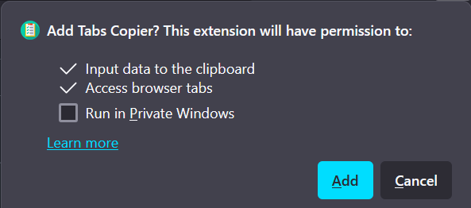

# Tabs Copier Extension

## Description
Simple extension for Firefox browser that makes copying links from multiple tabs easier. This extension will copy links from specified tabs in currently active browser window, copied links will be saved in clipboard as a list where each line has one link. Additionally the order of the tabs will be preserved, so the leftmost tab will be the one on top, and the rightmost will be on the bottom of the list.

I find myself sometimes needing to copy link from multiple tabs to save or send somewhere and its starting to get annoying, so I decided to made this. Most likely wont maintain it long term as I doubt many people will use it, so feel free to fork and modify as you see fit.

This extension also allows user to open all of the links they have saved in clipboard in new tabs.

## How to install
#### Option 1 - Install from Firefox Add-ons browser:
1. Go to https://addons.mozilla.org/en-US/firefox/addon/tabs-copier/
2. Click "Add to Firefox"
3. Done

#### Option 2 - Manual installation:
1. Open latest [release](https://github.com/TheKiromen/TabsCopierExtension/releases/tag/v1.2.0) and download `TabsCopier.xpi`
    - You can also download it using [this direct link](https://github.com/TheKiromen/TabsCopierExtension/releases/download/v1.2.0/TabsCopier_1.2.xpi) 
2. Firefox should automatically pick it up and prompt you to add the extension:

5. Click "Add" and enjoy new addon
   - If it does not open automatically and instead downloads the file then just right click it -> Open with -> select Firefox 

## How to use
Right click on any tab, at the bottom you will have a context menu with the extension:

You will then have 4 available options:
- Copy all tabs - Copies links of all open tabs in currently active window
- Copy up to target tab - Copies links from start (leftmost) to the clicked tab, both first and target tab are inclusive.
- Copy from target tab - Copies links from the clicked tab to the last (rightmost) one, both target and last tab are inclusive
- Open tabs from copied links - Exatracts links saved in clipboard and opens them in new tabs 
