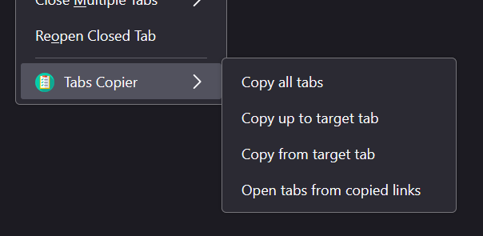

# Tabs Copier Extension

## Description
Simple extension for Firefox browser that makes copying links from multiple tabs easier. This extension will copy links from specified tabs in currenctly active browser window, copied links will be saved in clipboard as a list where each line has one link. Additionaly the order of the tabs will be preserved, so the leftmost tab will be the one on top, and the rightmost will be on the bottom of the list.

I find myself sometimes needing to copy link from multiple tabs to save or send somewhere and its starting to get annoying, so I decided to made this. Most likely wont maintain it long term as I doubt many people will use it, so feel free to fork and modify as you see fit.

## How to install
- TODO

## How to use
Right click on any tab, at the bottom you will have a context menu with the extension:

You will then have 3 aviable options:
- Copy all tabs - Copies links of all open tabs in currently active window
- Copy up to target tab - Copies links from start (leftmost) to the clicked tab, both first and target tab are inclusive.
- Copy from target tab - Copies links from the clicked tab to the last (rightmost) one, both target and last tab are inclusive
